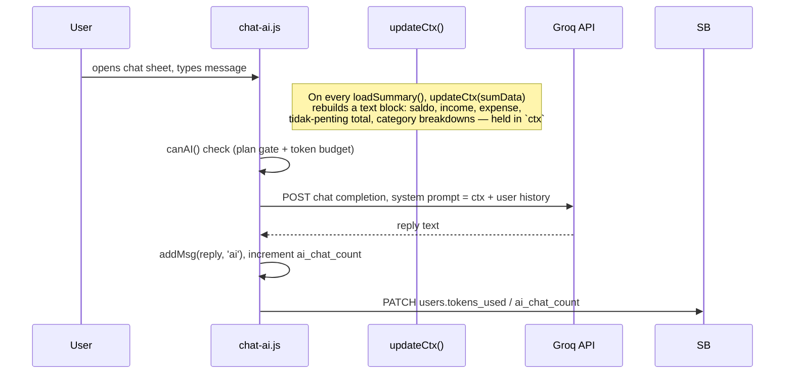
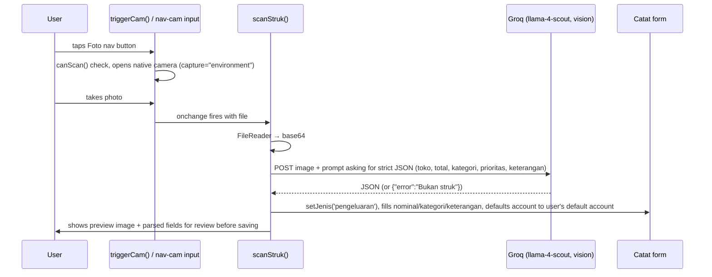

# AI Integration

All AI calls go to the **Groq** API (`https://api.groq.com/openai/v1/chat/completions`), OpenAI-compatible chat-completions format. There are three AI touchpoints:

## 1. AI Chat Assistant (`chat-ai.js`)

- **User input**: free text in the chat sheet, or a pre-set "chip" suggestion.
- **Context gathering**: `updateCtx(sumData)` in `dashboard.js` runs every time `loadSummary()` finishes, so the chat always has fresh numbers without a separate fetch.
- **Prompt construction**: the `ctx` string (Bahasa Indonesia, plain key-value summary) is injected ahead of the conversation history.
- **Gating**: `canAI()` (`ui-helpers.js`) — Free/Basic plans blocked outright; Pro/Ultimate checked against `tokens_limit`/`tokens_used` on the `users` row.
- **No tool calls** — this is a plain single-turn completion per message, not an agentic loop.
- **DB updates**: token/usage counters are patched back to `users` after each exchange.

## 2. Receipt Scanning (`transactions.js` → `scanStruk()`)

- **Model**: `meta-llama/llama-4-scout-17b-16e-instruct` (vision-capable).
- **Prompt** asks for category from the current default set (`makan/belanja/elektronik/pulsa/paket_data`) — update this prompt if you change `DEFAULT_CATEGORIES` in `config.js`, they can drift out of sync since one is a JS constant and the other is a string literal inside the fetch call.
- **Failure mode**: if the AI can't read the receipt, `scanStruk()` shows a toast and lets the user fill the form manually — nothing is auto-saved without the user reviewing/tapping submit.
- **Known limitation**: this only runs when the user manually opens the camera from inside the app. It cannot see or react to a photo taken by an external camera app — see `roadmap.md` if you're looking for the "auto-detect a payment notification" feature, which is a different (currently stubbed) mechanism, below.

## 3. Auto-Detect Transactions (stub — NOT actual AI, currently)

Settings → "Deteksi Transaksi Otomatis" is a client-side poller (`settings.js`, `pollDetectedTransactions()`) that checks the `detected_transactions` table every 15s for `status='pending'` rows and shows a confirm/dismiss popup. **Nothing in this repo populates that table** — a browser/PWA fundamentally cannot read other apps' notifications (GoPay, bank apps, etc.), that's an OS-level permission no web platform exposes. The intended design is: a phone-side automation tool (Tasker/MacroDroid) reads the notification and POSTs directly to Supabase's REST API (same anon key, same table) with a guessed `nominal_guess`/`jenis_guess`; the popup lets the user correct and confirm before it becomes a real transaction. No AI is involved unless you choose to add a parsing step to whatever posts into that table.

## 4. Fonnte WhatsApp bot (draft, see `backend.md`)

The draft Apps Script (`gas/wangku-backend.gs`) uses a Llama 3.3 text model (not vision) to extract `jenis/nominal/kategori/akun/prioritas/keterangan` from a WhatsApp message, with the user's real account and category names passed in as prompt context so it only picks from things that actually exist. This is **not yet verified against the actual live bot** — see `backend.md` for why, and don't assume this is what's currently running in production.
