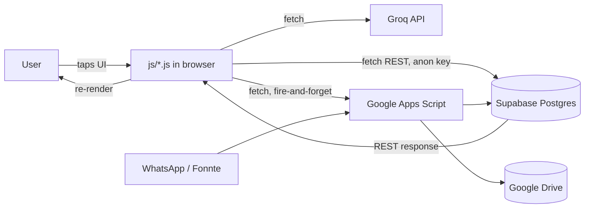
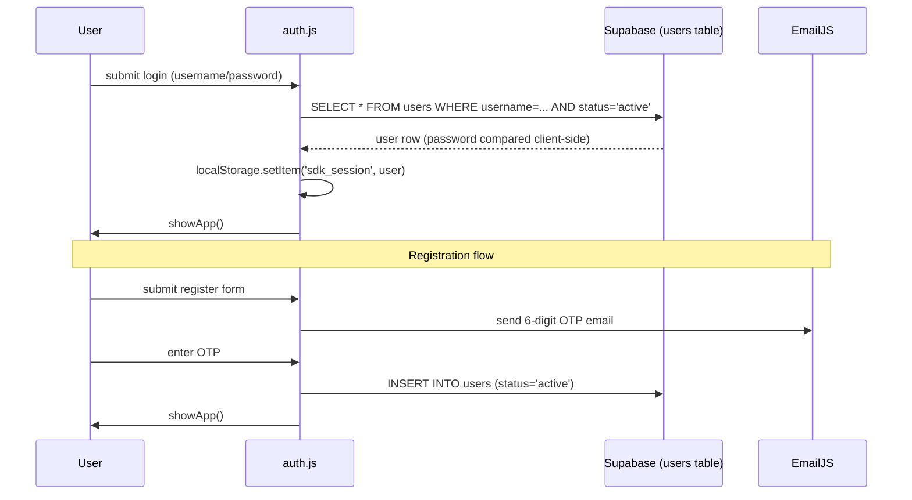
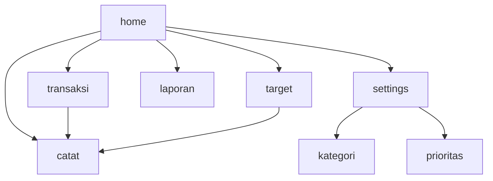

# Architecture

## 1. Folder structure

```
ai-finance-app/
├── index.html              # The entire app shell — every "page" is a <div class="page"> toggled by JS
├── admin.html               # Separate standalone admin panel (order approval, user/plan management)
├── landing.html              # Marketing/landing page (pre-login)
├── manifest.json              # PWA manifest
├── sw.js                       # Service worker (registered in boot.js, currently minimal)
├── twa-manifest.json             # Bubblewrap TWA config (package id, signing key, colors)
├── android.keystore               # Android signing key (Bubblewrap)
├── app-release-*.apk / .aab          # Built Android artifacts (Bubblewrap output)
├── app/, build.gradle, gradlew, ...    # Native Android wrapper project (Bubblewrap-generated)
├── css/
│   └── app.css                          # Single stylesheet, CSS variables for theming (light/dark)
├── js/
│   ├── config.js       # Constants: Supabase URL/key, plan definitions, default categories/accounts
│   ├── state.js        # Global mutable state (user, targets, sumData, etc.)
│   ├── ui-helpers.js    # rp()/rpF() formatters, getPlan(), canAI(), showToast(), sb() Supabase client
│   ├── auth.js           # Login, register (email OTP), forgot password, biometric (WebAuthn)
│   ├── app-core.js        # goPage() router, showApp() bootstrap, back-button/history handling
│   ├── dashboard.js        # loadSummary() (balance engine), renderPie(), renderLaporan()
│   ├── transactions.js      # Transaction CRUD, filters, targets CRUD, receipt-scan trigger
│   ├── accounts.js           # Account CRUD, balance breakdown popup
│   ├── categories.js          # Category CRUD (default + custom, unified)
│   ├── priorities.js           # Priority CRUD (default + custom, unified)
│   ├── chat-ai.js                # AI chat assistant (Groq)
│   ├── payment.js                 # Plan upgrade / payment proof submission flow
│   ├── settings.js                 # Profile, notifications, autosync, backup/reset, auto-detect
│   └── boot.js                       # Entry point: registers service worker, shows splash
├── database/
│   └── wangku-supabase-setup.sql      # Full schema, additive migration blocks numbered [1]…[16]
├── gas/
│   └── wangku-backend.gs               # (Draft, unverified against live script) Apps Script for
│                                          Fonnte webhook parsing + Drive backup — see backend.md
└── docs/                                  # You are here
```

## 2. Technology stack

- **Frontend**: Vanilla HTML/CSS/JS. No React/Vue, no bundler, no npm build step — files are served as-is.
- **Backend-as-a-service**: Supabase (Postgres, REST via PostgREST, using the anon key directly from the client).
- **AI**: Groq API — `meta-llama/llama-4-scout-17b-16e-instruct` for receipt image parsing, a Llama 3.x chat model for the AI assistant.
- **WhatsApp bot**: Fonnte (WhatsApp Business API provider) + a Google Apps Script webhook (see [backend.md](./backend.md) — this piece is currently undocumented in the repo itself).
- **Backup/sync**: Google Apps Script + Google Drive.
- **Hosting**: Vercel (static file hosting) at `ai-finance-app-gamma.vercel.app`.
- **Android packaging**: Bubblewrap CLI → Trusted Web Activity (TWA), signed APK/AAB.
- **Auth extras**: EmailJS (OTP delivery), WebAuthn (biometric unlock).

## 3. How data flows through the application



There is **no application server** in the traditional sense — the browser talks directly to Supabase's PostgREST API using the public anon key, and directly to Groq for AI calls. Google Apps Script is the only "backend" code that runs server-side, and only for two things: the WhatsApp bot and Drive backups.

## 4. Authentication flow



See [roadmap.md](./roadmap.md) for the security caveat on this flow (password handling and RLS).

## 5. Database schema and relationships
See [database.md](./database.md) for the full ERD. Summary: `users` is the root; `accounts`, `transactions`, `targets`, `user_categories`, `user_priorities`, `orders`, `detected_transactions` all hang off `user_id`.

## 6. API endpoints
See [api.md](./api.md). There's no custom REST API of ours — the app calls Supabase's auto-generated PostgREST endpoints directly, plus Groq's chat-completions endpoint, plus one Google Apps Script Web App URL.

## 7. AI integration flow
See [ai.md](./ai.md) for the two AI features (chat assistant, receipt scanning) with full sequence diagrams.

## 8. State management

There is no state library. Global mutable variables live in `js/state.js`:

```js
let user=null, chatHist=[], loading=false, sumData=null, jenis='pemasukan',
    targets=[], dP, fpUser=null, fpOTP=null, aiChat=0, aiScan=0;
```

Plus module-level `let` declarations at the top of `accounts.js` (`accountsList`), `categories.js` (`kategoriList`), `priorities.js` (`prioritasList`), `transactions.js` (`txnCache`, `txAllFilter`, `editingTrxId`, `editingTargetId`, `contributingTargetId`). Anything that needs to survive a page reload is persisted to `localStorage` (session, theme, notification prefs, autosync flag, etc.) — see [environment.md](./environment.md) for the full key list.

## 9. Component hierarchy
There are no components in the framework sense. `index.html` contains every "page" and every modal as sibling `<div>`s; JS toggles `.active`/`.open` classes to show/hide them. See [frontend.md](./frontend.md) for the full page/modal inventory.

## 10. Page routing

Routing is entirely client-side, via `goPage(name)` in `app-core.js` toggling `.page` divs — there are no real URL changes for in-app pages (the URL bar stays on `index.html`). To make the Android back button behave correctly, `goPage()` and every modal open/close push/consume `history` state (see the `popstate` handler at the bottom of `app-core.js`).



## 11. External services
Supabase, Groq, Fonnte, Google Apps Script/Drive, EmailJS, Vercel. Full list with what each is used for in [api.md](./api.md).

## 12. Environment variables
There is no `.env` — all config is hardcoded as JS constants in `js/config.js` (client-visible by nature, since this is a static site). See [environment.md](./environment.md).

## 13. Build and deployment process
No build step for the web app — Vercel serves the repo's static files directly. The Android app is built separately via Bubblewrap (`gradlew` / `bubblewrap build`), producing the APK/AAB checked into the repo root. See [deployment.md](./deployment.md).
