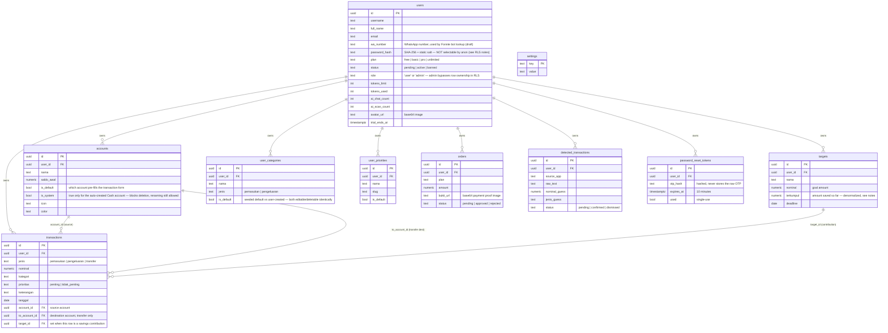

# Database

Postgres via Supabase. Schema lives entirely in `database/wangku-supabase-setup.sql`, applied as **additive, numbered migration blocks** (`[1]` through `[18]` as of this writing). The file is designed to be re-run safely from the top at any time — every block uses `IF NOT EXISTS`/`DROP ... IF EXISTS` guards. That property was hard-won (see "Migration history & lessons" below) and must be preserved in any future block.

## ERD

## Table notes

### `users`
Root of everything. `role='admin'` (or `username = MASTER` constant) grants unlimited plan + admin panel access. **Not** Supabase Auth — this is a plain table, and login is entirely custom (see the RLS/auth section below).

### `accounts`
Every user gets exactly one auto-created **Cash** account (`is_system=true`) on first load. It can be renamed but never deleted — enforced in `accounts.js` client-side (`deleteAccount()` checks `is_system` before allowing the call) — there's no database-level constraint blocking the delete, so don't rely on this being unbreakable from a raw API call. `is_default` is separate from `is_system`: the user can change which account is their default; the system account flag never changes.

### `transactions`
The core ledger. `jenis='transfer'` rows move money between two of the user's own accounts and are excluded from all income/expense totals. `target_id` is set when a row represents a savings contribution — it's still a normal `pengeluaran` row (money leaves the source account) but also increments the linked target's `terkumpul`.

**Balance model**: "Saldo Sekarang" on Home = `SUM(account.saldo_awal)` + all-time `pemasukan` − all-time `pengeluaran` (transfers excluded, since they're internal). This was changed partway through the project from a "current month only" model — if you see old code or docs describing a monthly-reset balance, that's stale. Optionally, target `terkumpul` totals are added on top if the user has enabled "Hitung Saldo Target" in Settings (`countTargetInBalance()` in `settings.js`).

### `targets`
`terkumpul` is a denormalized running total, incremented directly by app code (`submitContribution()` in `transactions.js`) whenever a contribution transaction is saved — **it is not computed by summing linked transactions at query time.** Any bulk import/backfill of transactions with `target_id` set must also patch `terkumpul` manually.

### `user_categories` / `user_priorities`
Defaults are seeded as real rows (`is_default=true`) once per user, the first time they load the app with none present (`seedDefaultCategories()`/`seedDefaultPriorities()`). Every category/priority — default or custom — lives in one table and is editable/deletable through the same full-page UI (Settings → Kelola Kategori / Kelola Prioritas). Current default set: Pemasukan = Gaji, Bonus; Pengeluaran = Makan, Belanja, Elektronik, Pulsa, Paket Data. **This changed more than once during development** — users who signed up under an earlier default set were not retroactively migrated, since seeding only fires when zero `is_default` rows exist yet.

### `orders`
Payment proof submissions for plan upgrades, reviewed manually via `admin.html`.

### `detected_transactions`
Support table for "auto-detect transactions." **Nothing in this codebase writes to it.** It's designed so a phone-side automation tool (Tasker/MacroDroid) posts directly to Supabase's REST API on notification-received, and the app polls + shows a confirm/dismiss popup. See `ai.md` and `roadmap.md`.

### `password_reset_tokens`
Backs the forgot-password flow. The OTP itself is generated inside Postgres (`create_password_reset`), returned once as plaintext so the client can email it via EmailJS, but only its **hash** is stored, with a 10-minute expiry and single-use flag, checked inside `confirm_password_reset`. This replaced an earlier version where the OTP was only ever checked in a JavaScript variable client-side — a real bypassable gap that's now closed.

### `settings`
Generic key-value table. **Fully locked down** (`FOR ALL USING (false)`) — nothing reads or writes it anymore since the Groq key moved to a Vercel environment variable. If you're tempted to use this table for new config, reconsider; it has no access path left by design.

## Custom auth & RLS — read this before touching any table's policy

This is the single most important thing to understand about this schema. It replaced an earlier state where **every table had `USING (true)`** — meaning the public Supabase anon key alone (necessarily embedded in client JS) could read and write *any* user's data. That's fixed now, via a from-scratch custom-auth layer (blocks `[17]` and `[18]`):

1. **`login_check(username, password_hash)`** verifies the password inside a `SECURITY DEFINER` function (so the client never queries `password_hash` directly — that column's `SELECT` privilege is revoked from `anon` entirely) and returns `{user, token}`, where `token` is a JWT signed with the project's real JWT secret.
2. **The signing is hand-rolled**, not via the `pgjwt` extension — `pgjwt`'s `sign()` has its own fixed internal search path that can't be overridden by a caller, which caused real failures in practice (see migration history below). Instead, `wangku_sign_jwt()` builds the JWT manually (base64url header + payload + HMAC-SHA256 signature via `pgcrypto`'s `hmac()`), inside a function where the search path is fully controlled.
3. **Every data table's policy** is `is_owner_or_admin(user_id)`: `(auth.jwt()->>'user_id')::uuid = user_id OR auth.jwt()->>'app_role' = 'admin'`.
4. **Registration** (no token exists yet) is allowed via a separate `anon`-scoped `INSERT` policy on `users`, but `WITH CHECK (status = 'pending' AND role = 'user')` — someone can't self-register as an active admin via a raw API call.
5. **`admin.html`** goes through the exact same `login_check` RPC (just checking `role='admin'` client-side after success) — it no longer has its own separate shared-password gate.

### Functions involved (all in `public` schema)
| Function | Purpose |
|---|---|
| `wangku_b64url(bytea)` | Base64url encode, no padding, no newlines |
| `wangku_sign_jwt(payload json, secret text)` | Manual HS256 JWT signing |
| `is_owner_or_admin(user_id uuid)` | The RLS predicate used everywhere |
| `login_check(username, password_hash)` | Password verify + mint token |
| `get_user_by_username(username)` | Biometric login — mints a fresh token |
| `get_user_by_id(user_id)` | Session restore — mints a fresh token (also silently upgrades pre-migration sessions) |
| `change_password(user_id, old_hash, new_hash)` | Requires proof of the old password |
| `create_password_reset(email)` | Step 1 of forgot-password — generates + stores hashed OTP |
| `confirm_password_reset(user_id, otp, new_hash)` | Step 2 — validates OTP server-side, then resets |

## Migration history & lessons (worth reading before writing new migrations)

This took three rounds to get right on the actual live Supabase project, each surfacing a genuine Postgres/Supabase behavior worth knowing:

1. **`CREATE POLICY IF NOT EXISTS` is not valid syntax** — Postgres's `CREATE POLICY` has no `IF NOT EXISTS` clause at all (unlike `CREATE TABLE`/`CREATE INDEX`). Every policy in this file now uses `DROP POLICY IF EXISTS "name" ON table; CREATE POLICY "name" ON table ...` instead. This was a latent bug sitting in the schema from very early on that only surfaced once the file was run start-to-finish instead of block-by-block.
2. **`CREATE OR REPLACE FUNCTION` cannot change a function's return type.** Several functions changed shape across blocks (`SETOF JSONB` → `JSONB`) as the auth design evolved. Every such redefinition needs an explicit `DROP FUNCTION IF EXISTS name(arg_types)` immediately before it — in **both** directions, since the file can be re-run on a database that's already at either end state.
3. **`pgjwt`'s `sign()` has a search path you cannot override from your own function** — Postgres resolves names inside a *called* function using that function's own configured search path, not the caller's. No amount of `SET search_path` on our own functions fixed `sign()` failing to find `hmac()`. The actual fix was to stop depending on `pgjwt` and hand-roll the signing using `pgcrypto`'s `hmac()` directly inside a function we fully control.

If a future migration hits `cannot change return type` or a `function ... does not exist` error from inside a third-party extension function, these are the first two things to check.
