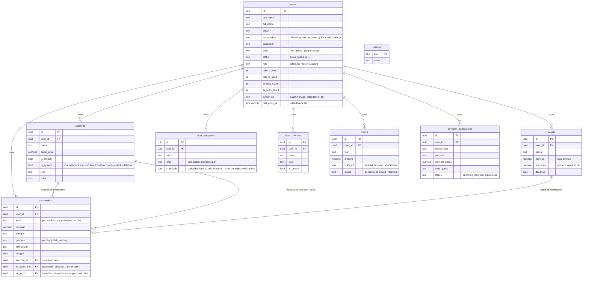

# Database

Postgres via Supabase. Schema lives entirely in `database/wangku-supabase-setup.sql`, applied as **additive, numbered migration blocks** (`[1]` through `[16]` at last count) — this file is meant to be re-run safely (`ADD COLUMN IF NOT EXISTS`, `CREATE TABLE IF NOT EXISTS`, etc.), not a one-shot script.

## ERD



## Table notes

### `users`
Root of everything. Also doubles as the auth table — see [roadmap.md](./roadmap.md) for why that's flagged as debt. `role='admin'` or `username===MASTER` (a constant in `config.js`) grants unlimited plan + admin UI access (see `admin.html`).

### `accounts`
Added mid-project (block 11) to support multiple wallets. Every user gets exactly one auto-created **Cash** account (`is_system=true`) on first load — it can be renamed but never deleted (enforced in `accounts.js`, not at the DB level). `is_default` marks which account pre-fills the transaction form; it's a separate flag from `is_system` because the user can change their default account, but the system account is permanent.

### `transactions`
The core ledger. `jenis='transfer'` rows move money between two of the user's own `accounts` and are **excluded** from all income/expense totals (they're an internal shuffle, not real income or spending). `target_id` is set when a transaction represents a savings contribution (see `submitContribution()` in `transactions.js`) — it's still a normal `pengeluaran` row (money leaves the source account) but also increments the linked target's `terkumpul`.

### `targets`
Savings goals. `terkumpul` is a denormalized running total, incremented directly by app code whenever a contribution transaction is saved — it is **not** computed by summing linked transactions at query time. Keep this in mind if you ever backfill/import transactions with `target_id` set; you must also update `terkumpul` yourself.

### `user_categories` / `user_priorities`
Originally these only held user-created custom entries, with a separate hardcoded list in the HTML for defaults. As of block 13, **defaults are seeded as real rows** (`is_default=true`) on first load, so every category/priority — default or custom — lives in one table and is editable/deletable through the same UI (Settings → Kelola Kategori / Kelola Prioritas, both full pages, not modals).

### `orders`
Payment proof submissions for plan upgrades. Reviewed manually via `admin.html`, not automated.

### `detected_transactions`
Support table for the "auto-detect transactions" feature. **Nothing in this repo writes to it automatically** — it's designed to be populated by a phone-side automation tool (Tasker/MacroDroid) posting directly to Supabase's REST API with the anon key, reading it via a webhook trigger on notification received. The web app only polls and reads/updates status. See [ai.md](./ai.md) and [roadmap.md](./roadmap.md).

### `settings`
Generic key-value table, present in the schema but not clearly wired to a specific feature at time of writing — worth checking before building on it (see [roadmap.md](./roadmap.md)).

## RLS policy status — READ THIS

Every table's Row Level Security policy in the current schema is:
```sql
CREATE POLICY "Allow all X" ON public.X FOR ALL USING (true) WITH CHECK (true);
```
This means **the anon key (which is public, embedded in client JS) can read and write every row in every table, for every user** — there is no per-user isolation enforced by the database. The app relies entirely on client-side `user_id=eq....` filters in its own queries to behave correctly; nothing stops a modified client (or anyone with devtools) from querying another user's data directly. This is flagged in detail in [roadmap.md](./roadmap.md) — it's the single biggest thing to fix before this app handles real money data at scale.
