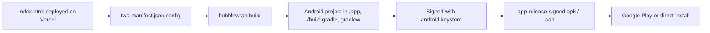

# Deployment

## Web (PWA)

- **Host**: Vercel, static file serving — no build command, no framework detection needed since it's plain HTML/CSS/JS. Live at `ai-finance-app-gamma.vercel.app` (per `twa-manifest.json`'s `host`/`fullScopeUrl`).
- **Deploy trigger**: presumably a push to the connected branch on `github.com/ariftafachrizal/ai-finance-app` — confirm this in the Vercel dashboard if unsure, it's not configured in-repo (no `vercel.json` found).
- **Service worker**: `sw.js`, registered in `boot.js`. Currently minimal — check its contents before assuming it does offline caching; at time of writing it's a thin registration with no elaborate cache strategy.

## Android (TWA via Bubblewrap)

- The Android app is a **thin wrapper** — it's a Chrome-based Trusted Web Activity pointing at the live Vercel URL. There's no separate Android codebase to maintain beyond the Bubblewrap-generated project files (`app/`, `build.gradle`, `gradlew`, etc.) and `twa-manifest.json`.
- **Digital Asset Links**: for the TWA to run full-screen without Chrome's UI/disclosure snackbar, `https://<host>/.well-known/assetlinks.json` must correctly declare the APK's SHA-256 signing fingerprint. This lives on the **hosting side** (Vercel), not in this repo's tracked files — verify it's actually deployed and matches the current `android.keystore` if you ever see Chrome UI creeping back in after a resign.
- **Rebuilding after a signing key or config change**: re-run `bubblewrap update` / `bubblewrap build` after editing `twa-manifest.json`, then re-sign with `android.keystore` (path is hardcoded in `twa-manifest.json`'s `signingKey.path` — that's a local absolute path, `/home/arif/Documents/...`, so builds are currently tied to Arif's machine setup).
- **Back-button behavior**: fixed at the web-app layer (`app-core.js`'s `history.pushState`/`popstate` handling) rather than via native Android config — see `roadmap.md` for the residual risk (WebView process death during external Camera intents) that this doesn't fully cover.

## What's NOT automated
- No CI. No automated APK signing/build pipeline — Bubblewrap commands are run manually.
- No staging environment — Vercel likely gives preview deploys per branch/PR by default, but there's no separate Supabase project for staging vs. production, so any schema/data testing happens against the same database as real users unless you deliberately point a local checkout at a different Supabase project URL.
