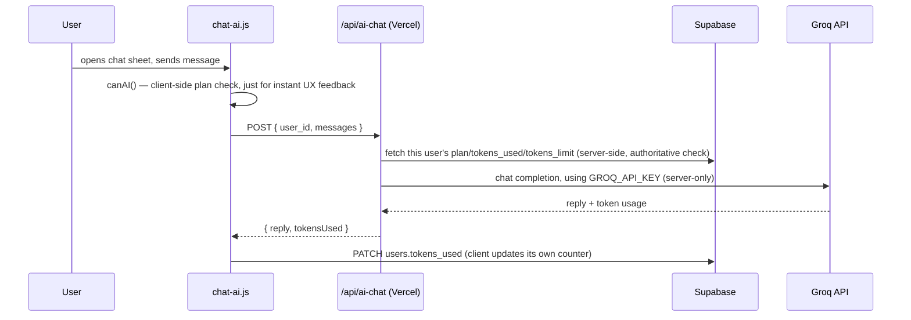
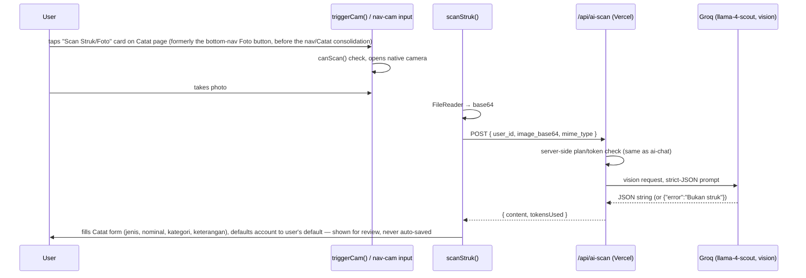

# AI Integration

All AI calls go to **Groq** (OpenAI-compatible chat-completions API), but as of the security work, always through Vercel serverless functions — never directly from the browser. See `backend.md` for why.

## 1. AI Chat Assistant (`chat-ai.js` → `/api/ai-chat.js`)

- **Context gathering**: `updateCtx(sumData)` in `dashboard.js` rebuilds a plain-language summary (saldo, income, expense, category breakdowns) every time `loadSummary()` finishes, so chat always has fresh numbers without an extra fetch.
- **Gating happens twice**: client-side (`canAI()`, instant feedback, skippable by a modified client) and server-side inside `/api/ai-chat.js` (the real check, using the user's actual DB row — this is what actually matters).
- No tool calls, no agent loop — single-turn completion per message.
- **The chat system prompt (`SYS` in `chat-ai.js`) has its own hardcoded category vocabulary** for the "catat transaksi via chat" JSON action — `makanan/transportasi/belanja/tagihan/hiburan/gaji/bonus/arisan/lainnya` — which diverges from the real seeded category set (`makan/belanja/elektronik/pulsa/paket_data`, `gaji/bonus`). This is a third place that needs to stay in sync with `DEFAULT_CATEGORIES`, beyond the two already tracked in `roadmap.md`'s dead-code/drift item — and it currently diverges the most of the three.

## 2. Receipt Scanning (`transactions.js` → `scanStruk()` → `/api/ai-scan.js`)

- **Model**: `meta-llama/llama-4-scout-17b-16e-instruct`.
- **Category hint in the prompt** must be kept in sync with `DEFAULT_CATEGORIES` in `config.js` — these are two separate hardcoded places and have drifted before.
- Camera trigger (`triggerCam()`) now gives explicit toast feedback on empty/cancelled capture instead of failing silently (this was a real, if minor, reported bug).
- **Known unresolved risk**: if Android kills the WebView process while the native camera app is in the foreground (a real, documented TWA/low-memory-device behavior), the scan can appear to silently fail. This is a native-Android-layer issue, not fixable from this web codebase alone — see `roadmap.md`.

## 3. Auto-Detect Transactions — stub, not real AI (yet)

Settings → "Deteksi Transaksi Otomatis" polls the `detected_transactions` table every 15s for `status='pending'` rows and shows a confirm/dismiss popup. **Nothing in this codebase writes to that table.** A browser fundamentally cannot read another app's notifications (GoPay, bank apps) — that's an OS-level permission no web platform exposes. The intended design: a phone-side automation tool (Tasker/MacroDroid) posts directly to Supabase's REST API on notification-received; the popup lets the user correct/confirm before it becomes a real transaction. No AI is involved unless a parsing step is added to whatever posts into that table.

## 4. Fonnte WhatsApp bot (`gs/fonnte.gs`) — real, not an actual AI call despite the function name

A keyword/whole-word-matching parser (`analisaDenganAI()` in `gs/fonnte.gs` — the name is a holdover, this is **not** an actual LLM call, just hardcoded classification logic) extracts `jenis`/`kategori`/`account`/`keterangan` from a WhatsApp message, matching against the user's real `accounts`/`user_categories` fetched fresh per incoming message. See `backend.md` for the full breakdown of what it does and what was fixed this session (service-role auth, `account_id` attribution, all-time balance model, real-category matching, account-name extraction). If a genuine LLM-based extraction (actually calling Groq, like `chat-ai.js`/`ai-scan.js` do) is ever wanted here instead of keyword matching, that's a separate, larger change — not what this file currently does despite its function name.
