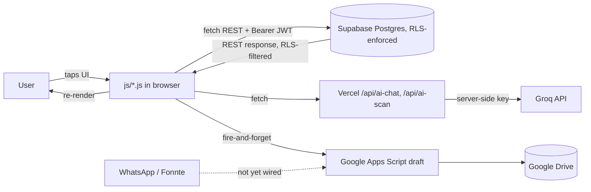
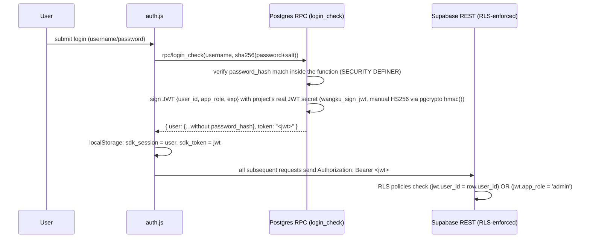
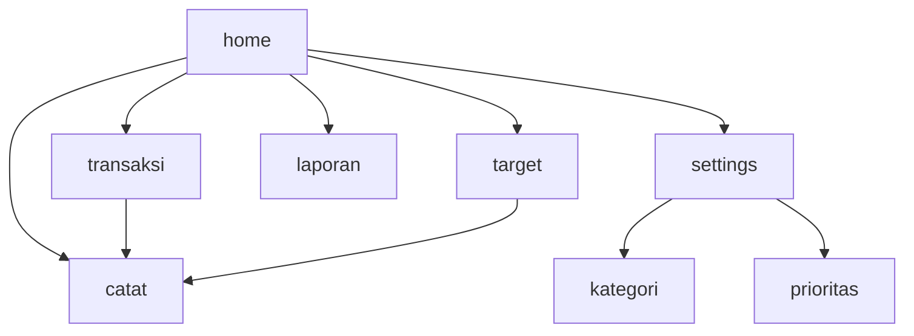

# Architecture

## 1. Folder structure

```
ai-finance-app/
├── index.html              # The entire consumer app — every "page" is a <div class="page"> toggled by JS
├── admin.html               # Separate standalone admin panel (real login, user/plan management, transactions view)
├── landing.html              # Marketing/landing page (pre-login)
├── manifest.json              # PWA manifest
├── sw.js                       # Service worker (registered in boot.js, minimal)
├── twa-manifest.json             # Bubblewrap TWA config (package id, signing key, colors)
├── android.keystore               # Android signing key (Bubblewrap)
├── app-release-*.apk / .aab          # Built Android artifacts (Bubblewrap output)
├── app/, build.gradle, gradlew, ...    # Native Android wrapper project (Bubblewrap-generated)
├── css/
│   └── app.css                          # Single stylesheet, CSS variables for theming (light/dark)
├── js/
│   ├── config.js       # Constants: Supabase URL/anon key, plan/limits definitions, default categories/accounts
│   ├── state.js        # Global mutable state (user, targets, sumData, jenis, etc.)
│   ├── ui-helpers.js    # rp()/rpF() formatters, getPlan(), canAI(), showToast(), sb()/rpc() clients
│   ├── auth.js           # Login, register (email OTP), forgot password (server-verified OTP), biometric
│   ├── app-core.js        # goPage() router + back-button history handling, showApp() bootstrap, session refresh, logout/auth-expiry
│   ├── dashboard.js        # loadSummary() (balance engine), renderPie(), renderLaporan(), sparkline, insight card, health score
│   ├── transactions.js      # Transaction CRUD, filters, Excel export, target CRUD + contributions, receipt-scan trigger
│   ├── accounts.js           # Account CRUD, balance breakdown popup
│   ├── categories.js          # Category CRUD (default + custom, unified, full-page management)
│   ├── priorities.js           # Priority CRUD (default + custom, unified, full-page management)
│   ├── chat-ai.js                # AI chat assistant — calls /api/ai-chat, never touches Groq directly
│   ├── payment.js                 # Plan display, upgrade/downgrade picker, payment proof submission
│   ├── settings.js                 # Profile, notifications, autosync, reset-data, auto-detect stub
│   └── boot.js                       # Entry point: registers service worker, shows splash
├── api/
│   ├── ai-chat.js                     # Vercel serverless function — proxies chat completions to Groq
│   └── ai-scan.js                      # Vercel serverless function — proxies receipt-scan (vision) to Groq
├── database/
│   └── wangku-supabase-setup.sql        # Full schema, additive migration blocks [1]…[21] (see database.md)
└── docs/                                  # You are here
```

**No `gas/` folder exists in this repo** (not even in git history). A Google Apps Script backend (`wangku-backend.gs` — Fonnte webhook + Drive backup) was drafted during planning conversations but never actually committed here, pending a decision between building on Fonnte vs. switching to an Evolution API-based WhatsApp integration. Don't assume this file exists or try to reference it as if it were real code sitting in the repo — see `backend.md`/`ai.md` for what the *planned* design was.

## 2. Technology stack

- **Frontend**: Vanilla HTML/CSS/JS. No React/Vue, no bundler, no build step.
- **Backend-as-a-service**: Supabase (Postgres via PostgREST). No custom application server.
- **Auth**: Custom — not Supabase Auth. Login verifies a password hash inside a Postgres function and mints a hand-signed JWT (HS256, using the project's real Supabase JWT secret) that the client then uses as its Bearer token for everything else. See §4 and `database.md`'s RLS section.
- **AI**: Groq API (`meta-llama/llama-4-scout-17b-16e-instruct` for receipt vision, a Llama 3.x chat model for the assistant) — called only from Vercel serverless functions, never from the browser.
- **WhatsApp bot**: Fonnte + Google Apps Script — **planning-stage draft only, no code committed to this repo** (see `backend.md`).
- **Hosting**: Vercel, both the static site and the `/api` serverless functions.
- **Android packaging**: Bubblewrap CLI → Trusted Web Activity (TWA), signed APK/AAB.
- **Email**: EmailJS (OTP delivery for registration and password reset).

## 3. How data flows through the application



The browser never talks to Groq directly, and every Supabase request now carries a real per-user JWT (not just the shared anon key) — this is a meaningfully different picture from earlier in the project's history, where the client held the Groq key and Supabase RLS allowed anyone to read/write anyone's rows.

## 4. Authentication flow (custom JWT, not Supabase Auth)



Biometric login (`get_user_by_username`) and session restore (`get_user_by_id`) follow the same pattern — both are RPCs that verify status/existence and mint a fresh token, so a legacy session (no token yet) gets silently upgraded to a real token the next time the app loads, without forcing a re-login.

`admin.html` uses the **exact same `login_check` RPC**, just requiring `result.user.role === 'admin'`, and stores its own token separately. This replaced an earlier single shared static password that had nothing to do with real accounts.

**This diagram covers server-side auth only.** After a successful `login_check`/`get_user_by_id`, the consumer app (not `admin.html`) inserts one more, purely local gate before `showApp()` runs: a PIN-lock screen (set-PIN on first use, verify-PIN thereafter), checked against a device-local `localStorage` value with no server round-trip at all. It's a second, local-only layer on top of everything above, not a replacement for any of it — see `frontend.md`'s "Local PIN lock" section for the full flow.

Password itself: SHA-256 with a static, shared salt (`hp()` in `ui-helpers.js`) — this is flagged as a known weakness in `roadmap.md`, not something to copy as a pattern.

## 5. Row Level Security (the thing that actually enforces per-user isolation)

Every data table's RLS policy checks:
```sql
(auth.jwt()->>'user_id')::uuid = user_id   OR   auth.jwt()->>'app_role' = 'admin'
```
via a shared helper function `is_owner_or_admin(user_id)`. This is what actually stops one user's browser from reading or writing another user's rows — the JWT alone doesn't do anything by itself; it's the RLS policies checking its claims that matter. See `database.md` for the full table-by-table breakdown and the migration history of how this was reached (it took a few rounds to get the Postgres function-return-type and extension-search-path details right — worth reading if you're touching any of these RPCs).

## 6. Database schema and relationships
See [database.md](./database.md) for the full ERD and every migration block.

## 7. API endpoints
See [api.md](./api.md). No custom application API — direct PostgREST access (now JWT-gated), Postgres RPC functions for anything sensitive (auth, password reset), and two Vercel serverless functions for AI.

## 8. AI integration flow
See [ai.md](./ai.md).

## 9. State management

No state library. Global mutable variables in `js/state.js`:
```js
let user=null, chatHist=[], loading=false, sumData=null, jenis='pemasukan',
    targets=[], dP, fpUser=null, fpOTP=null, aiChat=0, aiScan=0;
```
Plus module-level `let` in `accounts.js` (`accountsList`), `categories.js` (`kategoriList`), `priorities.js` (`prioritasList`), and several in `transactions.js` (`txnCache`, `txAllFilter`, `txAllList`, `editingTrxId`, `editingTargetId`, `contributingTargetId`). Anything that needs to survive a reload goes to `localStorage` — full key list in `environment.md`, including the newer `sdk_token` (JWT), `wangku_balance_hidden`, `wangku_count_target_balance`.

## 10. Component hierarchy
No framework components. `index.html` holds every "page" and every modal as sibling `<div>`s; JS toggles `.active`/`.open` classes. Full inventory in `frontend.md`.

## 11. Page routing

Entirely client-side via `goPage(name)` in `app-core.js`. As of the security/UX work, this also:
- Pushes/consumes real browser `history` state so the **Android back button navigates within the app instead of exiting/restarting the TWA** (this was a genuine bug, fixed at the web layer).
- A `MutationObserver` watches every `.modal-overlay` and does the same for modal open/close, so back also closes the topmost open modal first.
- Toggles `.compact` on `.header`, collapsing to a mini balance readout on every page except Home (the full balance card itself now lives inside the *scrollable* Home page content, not the fixed header — see `frontend.md`).



## 12. External services
Supabase, Groq (via Vercel proxy), Fonnte (draft/unverified), Google Apps Script/Drive (draft), EmailJS, Vercel. Full breakdown in `api.md`.

## 13. Environment variables
No `.env` for the static site (all client-visible constants in `js/config.js`, which is fine for a Supabase-anon-key architecture). The Vercel serverless functions **do** use real environment variables (`GROQ_API_KEY`) that never reach the client. Full list in `environment.md`.

## 14. Build and deployment process
No build step for the web app. The `/api` folder is auto-detected by Vercel as serverless functions alongside the static site. Android is built separately via Bubblewrap. See `deployment.md`.
