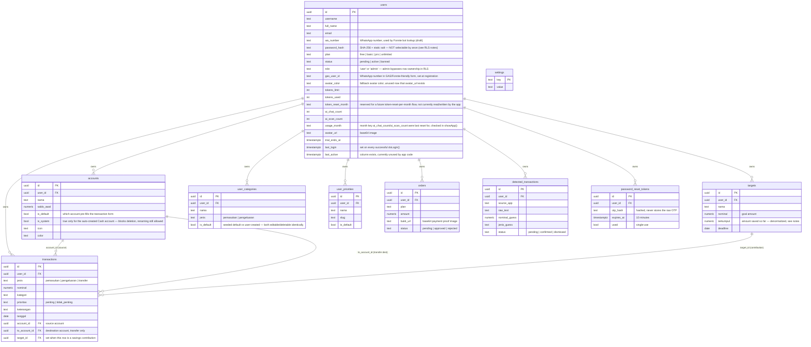

# Database

Postgres via Supabase. Schema lives entirely in `database/wangku-supabase-setup.sql`, applied as **additive, numbered migration blocks** (`[1]` through `[23]` as of this writing). The file is designed to be re-run safely from the top at any time — every block uses `IF NOT EXISTS`/`DROP ... IF EXISTS` guards. That property was hard-won (see "Migration history & lessons" below) and must be preserved in any future block.

## ERD

## Table notes

### `users`
Root of everything. `role='admin'` (or `username = MASTER` constant) grants unlimited plan + admin panel access. **Not** Supabase Auth — this is a plain table, and login is entirely custom (see the RLS/auth section below).

### `accounts`
Every user gets exactly one auto-created **Cash** account (`is_system=true`) on first load. It can be renamed but never deleted — enforced in `accounts.js` client-side (`deleteAccount()` checks `is_system` before allowing the call) — there's no database-level constraint blocking the delete, so don't rely on this being unbreakable from a raw API call. `is_default` is separate from `is_system`: the user can change which account is their default; the system account flag never changes.

### `transactions`
The core ledger. `jenis='transfer'` rows move money between two of the user's own accounts and are excluded from all income/expense totals. `target_id` is set when a row represents a savings contribution — it's still a normal `pengeluaran` row (money leaves the source account) but also increments the linked target's `terkumpul`.

**Balance model**: "Saldo Sekarang" on Home = `SUM(account.saldo_awal)` + all-time `pemasukan` − all-time `pengeluaran` (transfers excluded, since they're internal). This was changed partway through the project from a "current month only" model — if you see old code or docs describing a monthly-reset balance, that's stale. Optionally, target `terkumpul` totals are added on top if the user has enabled "Hitung Saldo Target" in Settings (`countTargetInBalance()` in `settings.js`).

### `targets`
`terkumpul` is a denormalized running total, incremented directly by app code (`submitContribution()` in `transactions.js`) whenever a contribution transaction is saved — **it is not computed by summing linked transactions at query time.** Any bulk import/backfill of transactions with `target_id` set must also patch `terkumpul` manually.

### `user_categories` / `user_priorities`
Defaults are seeded as real rows (`is_default=true`) once per user, the first time they load the app with none present (`seedDefaultCategories()`/`seedDefaultPriorities()`), reading from `DEFAULT_CATEGORIES`/`DEFAULT_PRIORITIES` in `js/config.js`. Every category/priority — default or custom — lives in one table and is editable/deletable through the same full-page UI (Settings → Kelola Kategori / Kelola Prioritas). Current default set: Pemasukan = Gaji, Bonus; Pengeluaran = Makan, Belanja, Elektronik, Pulsa, Paket Data. **This changed more than once during development** — users who signed up under an earlier default set were not retroactively migrated, since seeding only fires when zero `is_default` rows exist yet.

`user_categories` is unique on `(user_id, nama, jenis)` (block `[19]`) — not just `(user_id, nama)`. The narrower constraint used to block adding a category name that already existed under the other `jenis` (e.g. couldn't add "Arisan" as a Pengeluaran category if "Arisan" already existed as Pemasukan), which was both a bug report and a blocker for the same-name-different-jenis use case. Fixed once, for both.

**As of block `[23]`, uniqueness is case-insensitive** — enforced via a `UNIQUE INDEX ... (user_id, lower(nama), jenis)` rather than a plain column-list constraint (Postgres unique constraints can't reference expressions like `lower(...)`, only unique indexes can). This replaced the block-`[19]` constraint, not stacked alongside it. Root cause it fixes: `DEFAULT_CATEGORIES` seeds lowercase (`'bonus'`), the UI displays categories with the first letter capitalized purely for readability (`charAt(0).toUpperCase()`) without ever touching the stored value, and Postgres's default text comparison is case-*sensitive* — so a user manually typing "Bonus" (believing it's the same category as the default they see displayed as "Bonus") was creating a byte-different row that the old exact-match constraint couldn't catch. It only caught a *second* identical-case attempt against that new row, which read as "inconsistent" duplicate detection until traced to the byte level. `categories.js` also lowercases `nama` client-side before every insert/update now, so stored values stay consistently lowercase (matching the existing capitalize-on-display convention) — the DB index is the authoritative backstop, the client-side lowercasing is just for data hygiene.

### `orders`
Payment proof submissions for plan upgrades, reviewed manually via `admin.html`.

### `detected_transactions`
Support table for "auto-detect transactions." **Nothing in this codebase writes to it.** It's designed so a phone-side automation tool (Tasker/MacroDroid) posts directly to Supabase's REST API on notification-received, and the app polls + shows a confirm/dismiss popup. See `ai.md` and `roadmap.md`.

### `password_reset_tokens`
Backs the forgot-password flow. The OTP itself is generated inside Postgres (`create_password_reset`), returned once as plaintext so the client can email it via EmailJS, but only its **hash** is stored, with a 10-minute expiry and single-use flag, checked inside `confirm_password_reset`. This replaced an earlier version where the OTP was only ever checked in a JavaScript variable client-side — a real bypassable gap that's now closed.

Both `create_password_reset` and `confirm_password_reset` call `digest()` from `pgcrypto`. They originally had `SET search_path = public` (no `extensions` schema), which made forgot-password fail end-to-end with `function digest(text, unknown) does not exist` — the same class of bug the `[18]` JWT-signing functions had already hit and fixed for themselves, just missed on these two. Both now use `SET search_path = public, extensions`.

### `settings`
Generic key-value table. **Fully locked down** (`FOR ALL USING (false)`) — nothing reads or writes it anymore since the Groq key moved to a Vercel environment variable. If you're tempted to use this table for new config, reconsider; it has no access path left by design.

## Custom auth & RLS — read this before touching any table's policy

This is the single most important thing to understand about this schema. It replaced an earlier state where **every table had `USING (true)`** — meaning the public Supabase anon key alone (necessarily embedded in client JS) could read and write *any* user's data. That's fixed now, via a from-scratch custom-auth layer (blocks `[17]` and `[18]`):

1. **`login_check(username, password_hash)`** verifies the password inside a `SECURITY DEFINER` function (so the client never queries `password_hash` directly — that column's `SELECT` privilege is revoked from `anon` entirely) and returns `{user, token}`, where `token` is a JWT signed with the project's real JWT secret. As of block `[20]`, it also requires `status = 'active'`, matching `get_user_by_username`/`get_user_by_id`. Before that fix, a `pending`/`banned` account's correct password still got a validly-signed 30-day JWT back from the RPC itself — the web client discarded it (it checks `result.user.status` before persisting the token), but a direct call to the RPC (it's `GRANT`ed to `anon`) bypassed that client-side gate entirely.
2. **The signing is hand-rolled**, not via the `pgjwt` extension — `pgjwt`'s `sign()` has its own fixed internal search path that can't be overridden by a caller, which caused real failures in practice (see migration history below). Instead, `wangku_sign_jwt()` builds the JWT manually (base64url header + payload + HMAC-SHA256 signature via `pgcrypto`'s `hmac()`), inside a function where the search path is fully controlled.
3. **Every data table's policy** is `is_owner_or_admin(user_id)`: `(auth.jwt()->>'user_id')::uuid = user_id OR auth.jwt()->>'app_role' = 'admin'`.
4. **Registration** (no token exists yet) is allowed via a separate `anon`-scoped `INSERT` policy on `users`, but `WITH CHECK (status = 'pending' AND role = 'user')` — someone can't self-register as an active admin via a raw API call. **Read the "Registration and `Prefer: return=representation`" section below before touching this policy or the registration flow** — the interaction between this policy and the client's request headers is subtler than it looks.
5. **`admin.html`** goes through the exact same `login_check` RPC (just checking `role='admin'` client-side after success) — it no longer has its own separate shared-password gate.

### Functions involved (all in `public` schema)
| Function | Purpose |
|---|---|
| `wangku_b64url(bytea)` | Base64url encode, no padding, no newlines |
| `wangku_sign_jwt(payload json, secret text)` | Manual HS256 JWT signing |
| `is_owner_or_admin(user_id uuid)` | The RLS predicate used everywhere |
| `login_check(username, password_hash)` | Password verify + mint token (requires `status='active'`, block `[20]`) |
| `get_user_by_username(username)` | Biometric login — mints a fresh token |
| `get_user_by_id(user_id)` | Session restore — mints a fresh token (also silently upgrades pre-migration sessions) |
| `change_password(user_id, old_hash, new_hash)` | Requires proof of the old password |
| `create_password_reset(email)` | Step 1 of forgot-password — generates + stores hashed OTP |
| `confirm_password_reset(user_id, otp, new_hash)` | Step 2 — validates OTP server-side, then resets |
| `wangku_check_account_balance()` | Trigger function, block `[21]` — see "Per-account balance enforcement" below |
| `check_registration_available(username, email)` | Block `[22]` — SECURITY DEFINER boolean check, see "Registration and `Prefer: return=representation`" below |

## Registration and `Prefer: return=representation` (block `[22]`) — read before touching registration or the `users` SELECT policy

Registration threw `new row violates row-level security policy for table "users"` in production, and the first-pass fix (forcing the anon key explicitly, in case a stale `sdk_token` from a prior session was leaking into the request) was **wrong** — plausible-looking, shipped, and didn't fix it, confirmed by testing the raw Supabase REST API directly with nothing but the genuine anon key.

**Actual root cause**: `sb()`/`sbAnon()` send `Prefer: return=representation` on every `POST`, so the client can read the row back immediately. That means Postgres also has to evaluate the **SELECT** policy against the newly-inserted row before it can return it — and no SELECT policy on `users` permits `anon` to see *any* row, including one it just created itself (`"Own row or admin - select"` requires a JWT `user_id` matching the row, which an anonymous pre-login request can never have). The `INSERT` itself is perfectly valid and passes `"Public registration"` — but Postgres fails the *entire statement* because it cannot satisfy the implicit read-back `return=representation` demands. Confirmed directly (via the Supabase MCP, live against this project): the identical `INSERT` succeeds with no `RETURNING`/representation requested, and fails identically whether or not a stale token is involved.

This also means `doRegister()`'s original duplicate-check (a plain `SELECT ... WHERE username=... OR email=...` as anon) was **separately, always broken** — it can never see an existing row as `anon` either, so it silently reported "available" even for a taken username/email.

**Fix**: don't ask Postgres to read anything back for anon writes to `users`.
- `verifyRegOTP()` (`auth.js`) now generates the new row's `id` client-side (`crypto.randomUUID()`), sends it explicitly in the `INSERT` payload, and uses `Prefer: return=minimal` (`sbAnon(path, method, body, minimal=true)` in `ui-helpers.js`) — so no SELECT policy is ever needed.
- The duplicate-check is now `check_registration_available(p_username, p_email)` — a `SECURITY DEFINER` RPC that returns **only a boolean**, not the matching row. This was deliberately chosen over adding a broader `anon`-scoped SELECT policy (e.g. `USING (status='pending' AND role='user')`), which would let anyone with the public anon key enumerate every pending registrant's email/WhatsApp number/full name indefinitely — a real information-disclosure risk not worth taking just to make a pre-check work.

**If a future flow needs to write to `users` (or any other table) as `anon` and also read the result back, it will hit this same wall** — either give it a real, narrowly-scoped SELECT policy, or (preferred, as done here) avoid needing the read-back at all.

## Per-account balance enforcement (block `[21]`)

A `BEFORE INSERT OR UPDATE ON transactions` trigger (`trg_check_account_balance` → `wangku_check_account_balance()`) blocks a `pengeluaran` or `transfer` row from pushing its source account (`account_id`) negative. The balance it checks is **per-account, all-time** — `accounts.saldo_awal` plus that one account's own transaction history (not the aggregate Saldo Sekarang) — so a transfer/expense is only blocked if *its own* account can't cover it, even if another of the user's accounts has plenty. `pemasukan` rows are never restricted. On `UPDATE` (editing an existing transaction), the row being edited is excluded from its own balance recalculation so it doesn't double-count against itself.

This is a safety net behind the primary UX, which is a client-side check in `js/transactions.js`/`js/accounts.js` (`getAccountBalance()`) that blocks submission with an inline toast before the request is even sent. Both layers use the same all-time balance model as Saldo Sekarang, deliberately, for consistency.

**Note for future split-payment work:** this trigger and the client check both assume one transaction has exactly one source `account_id`. If a "split a single payment across multiple accounts" feature is ever built (see `roadmap.md`), this logic will need revisiting — it wasn't written to accommodate multiple source accounts per transaction.

## Migration history & lessons (worth reading before writing new migrations)

This took three rounds to get right on the actual live Supabase project, each surfacing a genuine Postgres/Supabase behavior worth knowing:

1. **`CREATE POLICY IF NOT EXISTS` is not valid syntax** — Postgres's `CREATE POLICY` has no `IF NOT EXISTS` clause at all (unlike `CREATE TABLE`/`CREATE INDEX`). Every policy in this file now uses `DROP POLICY IF EXISTS "name" ON table; CREATE POLICY "name" ON table ...` instead. This was a latent bug sitting in the schema from very early on that only surfaced once the file was run start-to-finish instead of block-by-block.
2. **`CREATE OR REPLACE FUNCTION` cannot change a function's return type.** Several functions changed shape across blocks (`SETOF JSONB` → `JSONB`) as the auth design evolved. Every such redefinition needs an explicit `DROP FUNCTION IF EXISTS name(arg_types)` immediately before it — in **both** directions, since the file can be re-run on a database that's already at either end state.
3. **`pgjwt`'s `sign()` has a search path you cannot override from your own function** — Postgres resolves names inside a *called* function using that function's own configured search path, not the caller's. No amount of `SET search_path` on our own functions fixed `sign()` failing to find `hmac()`. The actual fix was to stop depending on `pgjwt` and hand-roll the signing using `pgcrypto`'s `hmac()` directly inside a function we fully control.
4. **The `extensions` search-path lesson from #3 doesn't automatically propagate to every function that calls a `pgcrypto` function.** `wangku_sign_jwt`/`wangku_b64url` got `SET search_path = public, extensions` when they were written (block `[18]`), but `create_password_reset`/`confirm_password_reset` (block `[17]`, calling `digest()`) were left with just `SET search_path = public` — which broke forgot-password in production with `function digest(text, unknown) does not exist`. Fixed by adding `extensions` to their search path too. **Any function that calls a `pgcrypto` function (`digest`, `hmac`, `crypt`, etc.) needs `extensions` in its `search_path`, full stop** — don't assume it's only relevant to the JWT-signing functions.
5. **Postgres combines multiple *permissive* RLS policies on the same table/command with OR — a new restrictive policy existing does not disable an old permissive one sitting next to it.** This bit in practice: after block `[18]` should have replaced every table's `"Allow all ..."` (`USING (true)`) policy with `"Own data or admin"`, a live check of `pg_policies` found **both policies present simultaneously on every single data table** (plus `settings`) — meaning the `USING (true)` policy was still winning via OR, and RLS was providing *zero* actual isolation despite the correct policy also existing. This most likely happened because an early re-run only touched blocks that create the `"Allow all ..."` policies (blocks `[1]`–`[14]`, which are also `DROP POLICY IF EXISTS`+`CREATE POLICY`, so they're idempotent but will happily recreate the permissive policy if run again after block `[18]` already removed it) without also re-running block `[18]`'s drops. **Whenever verifying RLS on this schema, don't just confirm the intended policy exists — run `SELECT tablename, policyname, cmd FROM pg_policies WHERE schemaname='public' ORDER BY tablename, policyname;` and confirm no stray `"Allow all ..."` policy is sitting alongside it on any table.** A restrictive-looking policy existing is not proof that access is actually restricted.
6. **`INSERT ... RETURNING` (or PostgREST's `Prefer: return=representation`, which is `RETURNING`-equivalent) requires the SELECT policy to permit reading the newly-inserted row — a valid INSERT policy is not enough on its own.** This cost real time chasing the wrong root cause for the registration RLS error (see "Registration and `Prefer: return=representation`" above): the actual `INSERT` was valid and passing its own policy the entire time; the request failed because it *also* implicitly needed a SELECT policy that plainly didn't and couldn't exist for an anonymous pre-login request. **If a write-as-`anon`-or-similarly-restricted-role flow fails with an RLS error, check whether the request is asking for the row back (`RETURNING`, or PostgREST's default `return=representation` on POST) before assuming the write policy itself is wrong** — test the identical statement with and without a returning clause to tell the two apart. Confirmed for this exact case by testing directly against the live database via the Supabase MCP: identical INSERT, no RETURNING → succeeds; with RETURNING → fails with the RLS error every time.
7. **A `UNIQUE(a, b, c)` constraint can be working *exactly* as defined and still fail to catch what a user would call a duplicate, if the app displays a transformed version of a value without ever normalizing the stored value to match.** `user_categories`' unique constraint was never broken — Postgres text comparison is case-sensitive by design, `DEFAULT_CATEGORIES` seeds lowercase, and the UI capitalizes the first letter for display only (`charAt(0).toUpperCase()`), never touching what's stored. A user typing "Bonus" into the add-category form — reasonably believing it's the same category shown on screen — created a byte-different row the constraint had no way to flag. **Before assuming a unique constraint is buggy or misapplied, check `pg_get_constraintdef()` (confirm it's exactly what you think) and diff the actual byte content of the "duplicate" rows (`encode(col::bytea,'hex')`)** — don't assume "duplicate" means byte-identical just because two rows look the same on screen. Fixed by switching to a `UNIQUE INDEX` on `lower(nama)` instead of `nama` directly (plain unique constraints can't reference expressions, only unique indexes can), plus lowercasing client-side before insert as a second layer of hygiene.

If a future migration hits `cannot change return type` or a `function ... does not exist` error from inside a third-party extension function, these are the first things to check. And if anything about per-user isolation seems off, check `pg_policies` directly rather than trusting that the last migration you ran did what it said.
