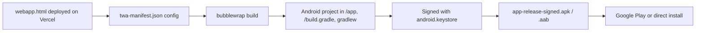

# Deployment

## Web (PWA + serverless functions)

- **Host**: Vercel, static file serving for `webapp.html`/`admin.html`/`landing.html`/`css`/`js`, **plus** the `/api` folder which Vercel auto-detects as serverless functions — no separate deployment step needed for that part. `vercel.json` *does* exist, but only for the root/`/app` routing split (see `architecture.md` §2a), not for anything API-related.
- **Root vs. `/app` routing**: landing page is `/`, the actual app is `/app` (`vercel.json` rewrites — physical files are unchanged, still at repo root). **If `twa-manifest.json`'s `startUrl` is ever changed, existing installed Android TWA users need a new APK/AAB build and re-sign (`bubblewrap update && bubblewrap build`, then re-sign with `android.keystore`) before it takes effect for them** — this is baked into the native app at build time, not fetched live from the deployed site.
- **Required setup**: `GROQ_API_KEY` must be set in Vercel → Project Settings → Environment Variables, or `/api/ai-chat.js` and `/api/ai-scan.js` will return a "server not configured" error and both AI features will appear broken to users even though the rest of the app works fine.
- **Deploy trigger**: presumably push to the connected branch on `github.com/ariftafachrizal/ai-finance-app` — confirm in the Vercel dashboard, not configured in-repo.
- **Service worker**: `sw.js`, minimal registration only, no elaborate offline caching strategy — don't assume offline support exists.

## Supabase — this is where most of the real deployment risk lives right now

`database/wangku-supabase-setup.sql` must be run (or re-run) against the live Supabase project **before** the corresponding client code is deployed, in this order:
1. Run the SQL (safe to run the whole file from the top at any time — every block is idempotent, see `database.md`'s migration-history notes).
2. Confirm the JWT secret placeholder inside `login_check`/`get_user_by_username`/`get_user_by_id` matches the project's real Supabase JWT secret (Dashboard → Project Settings → Data API → JWT Settings) — if this was ever rotated, the SQL functions must be updated to match or logins will fail.
3. Confirm `pgcrypto` extension is enabled (Database → Extensions) — required for the manual JWT signing (`wangku_sign_jwt`).
4. Deploy the JS/HTML changes.
5. Test end-to-end: login, register, forgot password, admin.html login, before considering it done. This has genuinely broken more than once during development from subtle Postgres behaviors (return-type changes, extension search paths) — see `database.md` for the specifics, so the same mistakes aren't repeated.

## Android (TWA via Bubblewrap)

- Thin wrapper — a Chrome-based Trusted Web Activity pointing at the live Vercel URL, no separate Android codebase beyond the Bubblewrap-generated project files.
- **Digital Asset Links** (`/.well-known/assetlinks.json` on the hosting side, not tracked in this repo) must correctly declare the APK's SHA-256 signing fingerprint for the TWA to run full-screen without Chrome's disclosure UI. This was previously an active visible issue ("Running on Chrome" popup) — reportedly fixed on the hosting/Android config side directly by the product owner, not through anything in this repo's code. Worth documenting exactly what was changed there, so it doesn't silently regress on a future resign/redeploy.
- **Android back-button behavior**: fixed at the *web app* layer (`history.pushState`/`popstate` handling in `app-core.js`), not via native Android config. This covers normal in-app navigation. It does **not** cover the separate, still-unresolved risk of Android killing the WebView process entirely during an external Camera intent (see `ai.md`/`roadmap.md`) — that would need native-side investigation if it's still an active complaint.
- **Rebuilding after any signing-key or config change**: re-run `bubblewrap update`/`bubblewrap build`, then re-sign with `android.keystore`. Note `twa-manifest.json`'s signing key path is a local absolute path tied to one machine's setup — builds aren't portable as-is.

## What's NOT automated
- No CI, no automated build/sign pipeline for the APK — all Bubblewrap commands run manually.
- No staging environment — there's one Supabase project, used for both development/testing and (eventually) production. Be deliberate about running schema changes against it.
